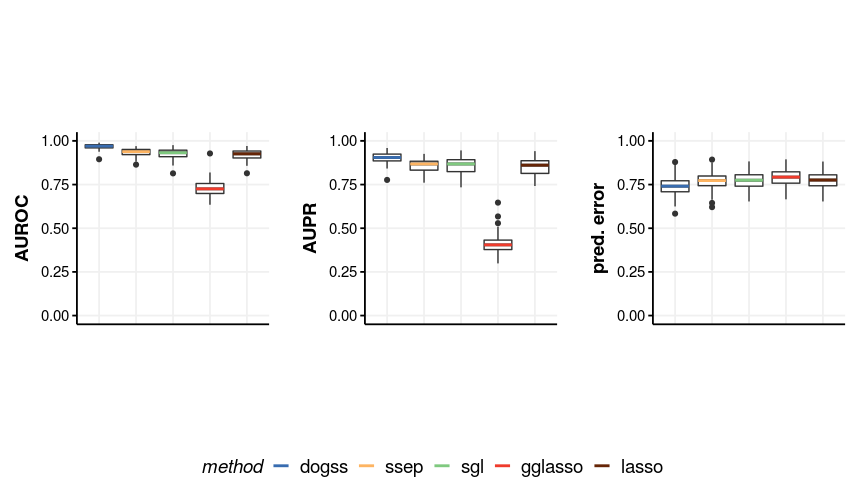
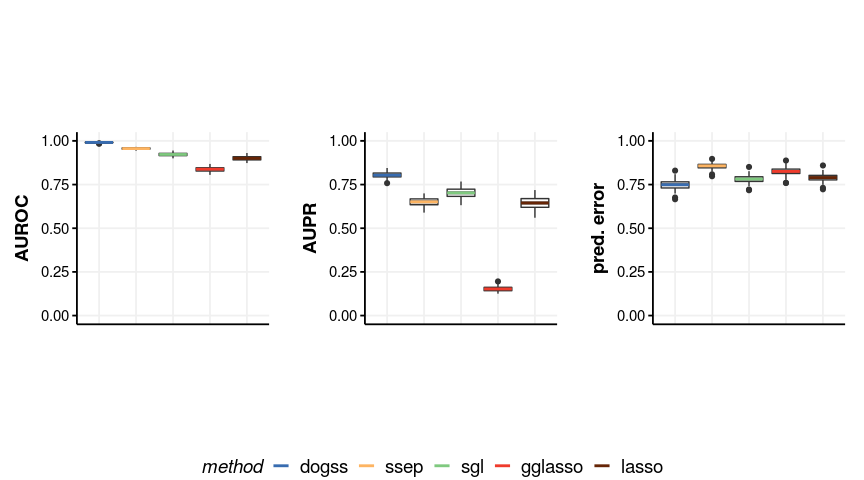
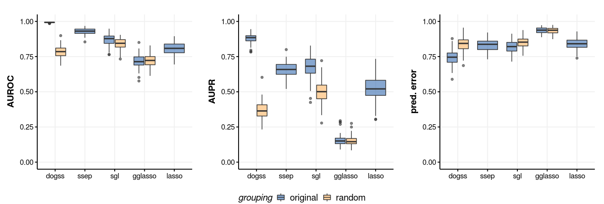
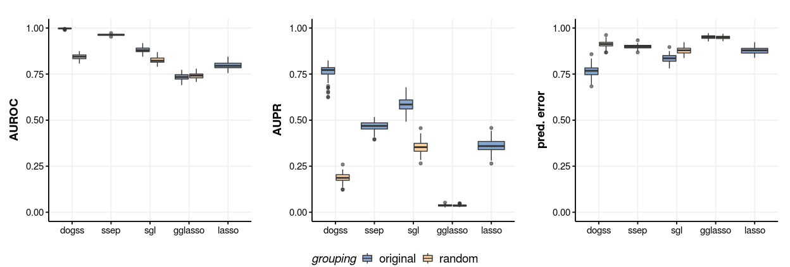

Network reconstruction with dogss: Simulations
================
Edgar Steiger
2018

-   [Simulations](#simulations)
-   [Sim networks](#sim-networks)
-   [different groupings](#different-groupings)

This document shows and explains how to use the dogss package and how to reproduce Figures 9 to 13 from our paper [Sparse-Group Bayesian Feature Selection Using Expectation Propagation for Signal Recovery and Network Reconstruction](https://arxiv.org/abs/1809.09367).

First we need to load some packages that are required for comparisons and plotting (please install if not available on your machine):

``` r
library(dogss) # our method for sparse-group Bayesian feature selection with EP
library(glmnet) # standard lasso
library(gglasso) # group lasso
library(SGL) # sparse-group lasso
library(MBSGS) # Bayesian feature selection with Gibbs sampling

library(ggplot2) # for nice plots
library(ggthemes) # for even nicer plots
library(grid); library(gridExtra) # to arrange plots pleasantly

library(reshape2) # to melt data into "tidy" long-format

library(DescTools) # for area computations (AUROC, AUPR)
```

Furthermore we need to load three R files with additional code:

``` r
source("../auxiliary_rfunctions/my_cvSGL.R") # proper cross validation for SGL package

source("../auxiliary_rfunctions/my_theme.R") # functions to adjust ggplots
```

Finally, we provide all of the results on our simulated data to reconstruct the plots from the publication. If you wish to re-do all of the simulations/calculations, change the following parameter to `TRUE` (only do this if you have access to multiple cores):

``` r
selfcompute <- FALSE
B <- 100 # number of simulations
ncores <- 50 # number of cores used for parallelization
```

Simulations
-----------

example network

``` r
  # load("~/Programme/dogss/testing/sim2/simnet_onetwothree_96_2.RData")
  par(oma=c(0,0,0,0), mar=c(0,0,0,0))
  plot.igraph(graph_from_adjacency_matrix(t(truth_matrix)), vertex.size=5, vertex.label=NA, vertex.color="white", vertex.frame.color=Ed_palette[1], vertex.shape=ifelse(row.names(truth_matrix) %in% names(G), "square", "circle"), edge.width=1, edge.arrow.mode=0, edge.curved=FALSE, vertex.label.family="CM Roman", asp=3/5) #  layout=layout.big
```

Sim networks
------------

``` r
  # load("~/Programme/dogss/testing/sim2/finalresults_networksim.RData")
  B <- 100
  for (i in 1:2) {
    auroc <- matrix(0, nrow=B, ncol=5, dimnames=list(run=1:100, method=c("dogss", "ssep", "sgl", "gglasso", "lasso")))
    aupr <- auroc
    prederror <- auroc
     
    for (b in 1:B) {
      load(paste0("/project/dogss/tests_thesis/02_networkreconstruction_qpgraph/02_networkreconstruction/net_onetwothree_", b, ".RData"))
      auroc[b, ] <- onetwothree[[i]]$AUROC
      aupr[b, ] <- onetwothree[[i]]$AUPR
      prederror[b, ] <- onetwothree[[i]]$prederror
    }

    data <- data.frame(melt(auroc), measure="auroc")
    data <- rbind(data, data.frame(melt(aupr), measure="aupr"))
    data <- rbind(data, data.frame(melt(prederror), measure="pred. error"))
    data$method <- factor(data$method, ordered=TRUE, levels=c("dogss", "ssep", "sgl", "gglasso", "lasso"))

    auroc_data <- subset(data, measure=="auroc")
    P_auroc <- ggplot(auroc_data, aes(x=method, y=value)) +
      geom_boxplot() +
      theme_Ed() +
      scale_colour_Ed() +
      ylim(0,1) +
      labs(y="AUROC") +
      theme(axis.title.x=element_blank(),
            axis.text.x=element_blank(),
            axis.ticks.x=element_blank())
    Pd_auroc <- ggplot_build(P_auroc)$data[[1]]
    P_auroc <- P_auroc + geom_segment(data=Pd_auroc, aes(x=xmin, xend=xmax, y=middle, yend=middle, colour=unique(auroc_data$method)), size=1, show.legend=TRUE) + labs(colour="method")

    aupr_data <- subset(data, measure=="aupr")
    P_aupr <- ggplot(aupr_data, aes(x=method, y=value)) +
      geom_boxplot() +
      theme_Ed() +
      scale_colour_Ed() +
      ylim(0,1) +
      labs(y="AUPR") +
      theme(axis.title.x=element_blank(),
            axis.text.x=element_blank(),
            axis.ticks.x=element_blank())
    Pd_aupr <- ggplot_build(P_aupr)$data[[1]]
    P_aupr <- P_aupr + geom_segment(data=Pd_aupr, aes(x=xmin, xend=xmax, y=middle, yend=middle, colour=unique(aupr_data$method)), size=1, show.legend=FALSE)
    
    prederror_data <- subset(data, measure=="pred. error")
    P_prederror <- ggplot(prederror_data, aes(x=method, y=value)) +
      geom_boxplot() +
      theme_Ed() +
      scale_colour_Ed() +
      ylim(0,1) +
      labs(y="pred. error") +
      theme(axis.title.x=element_blank(),
            axis.text.x=element_blank(),
            axis.ticks.x=element_blank())
    Pd_prederror <- ggplot_build(P_prederror)$data[[1]]
    P_prederror <- P_prederror + geom_segment(data=Pd_prederror, aes(x=xmin, xend=xmax, y=middle, yend=middle, colour=unique(prederror_data$method)), size=1, show.legend=FALSE)

    grid_arrange_shared_legend(P_auroc, P_aupr, P_prederror, ncol = 3, nrow = 1, which.legend = 1)

  }
```



different groupings
-------------------

``` r
  # load("~/Programme/dogss/testing/sim2_grouping_tfs/extra_results_network_grouping.RData")
  # load("/project/dogss/testing/testing/sim2_new/finalresults_sim2_new_area.RData")
  # mydata$method <- factor(mydata$method, ordered=TRUE, levels=c("dogss", "ssep", "sgl", "gglasso", "lasso"))
  # mydata$grouping <- factor(mydata$grouping, ordered=TRUE, levels=c("original", "kmeans", "random"))
  # mydata <- subset(mydata, !(method %in% c("ssep", "lasso") & grouping %in% c("kmeans", "random")))

  auroc <- data.frame(value=numeric(), method=character(), grouping=character())
  aupr <- data.frame(value=numeric(), method=character(), grouping=character())
  prederror <- data.frame(value=numeric(), method=character(), grouping=character())

  method <- c("dogss", "ssep", "sgl", "gglasso", "lasso")
  
  B <- 100

  for (b in 1:B) {
    load(paste0("/project/dogss/tests_thesis/02_networkreconstruction_qpgraph/02_networkreconstruction/small_net_whole_", b, ".RData"))
    
    for (m in 1:length(method)) {
      auroc <- rbind(auroc, data.frame(value=whole[[1]]$AUROC[m], method=method[m], grouping="original"))
      aupr <- rbind(aupr, data.frame(value=whole[[1]]$AUPR[m], method=method[m], grouping="original"))
      prederror <- rbind(prederror, data.frame(value=whole[[1]]$prederror[m], method=method[m], grouping="original"))
      if (m%in%c(1,3,4)) {
        auroc <- rbind(auroc, data.frame(value=whole[[2]]$AUROC[m], method=method[m], grouping="random"))
        aupr <- rbind(aupr, data.frame(value=whole[[2]]$AUPR[m], method=method[m], grouping="random"))
        prederror <- rbind(prederror, data.frame(value=whole[[2]]$prederror[m], method=method[m], grouping="random"))
      }

    }
    
  }

  plot_auroc <- ggplot(aes(y = value, x = method, fill = grouping), data = auroc) + geom_boxplot(alpha=0.6) + theme_Ed() + ylim(0, 1) + scale_fill_Ed() + theme(axis.title.x=element_blank()) + ylab("AUROC")
  plot_aupr <- ggplot(aes(y = value, x = method, fill = grouping), data = aupr) + geom_boxplot(alpha=0.6) + theme_Ed() + ylim(0, 1) + scale_fill_Ed() + theme(axis.title.x=element_blank()) + ylab("AUPR")
  plot_prederror <- ggplot(aes(y = value, x = method, fill = grouping), data = prederror) + geom_boxplot(alpha=0.6) + theme_Ed() + ylim(0, 1) + scale_fill_Ed() + theme(axis.title.x=element_blank()) + ylab("pred. error")

  grid_arrange_shared_legend(plot_auroc, plot_aupr, plot_prederror, ncol = 3, nrow = 1, which.legend = 1)
```



``` r
  ### large networks
  auroc <- data.frame(value=numeric(), method=character(), grouping=character())
  aupr <- data.frame(value=numeric(), method=character(), grouping=character())
  prederror <- data.frame(value=numeric(), method=character(), grouping=character())
  
  method <- c("dogss", "ssep", "sgl", "gglasso", "lasso")
  
  B <- 100
  
  for (b in 1:B) {
    load(paste0("/project/dogss/tests_thesis/02_networkreconstruction_qpgraph/02_networkreconstruction/net_whole_", b, ".RData"))
    
    for (m in 1:length(method)) {
      auroc <- rbind(auroc, data.frame(value=whole[[1]]$AUROC[m], method=method[m], grouping="original"))
      aupr <- rbind(aupr, data.frame(value=whole[[1]]$AUPR[m], method=method[m], grouping="original"))
      prederror <- rbind(prederror, data.frame(value=whole[[1]]$prederror[m], method=method[m], grouping="original"))
      if (m%in%c(1,3,4)) {
        auroc <- rbind(auroc, data.frame(value=whole[[2]]$AUROC[m], method=method[m], grouping="random"))
        aupr <- rbind(aupr, data.frame(value=whole[[2]]$AUPR[m], method=method[m], grouping="random"))
        prederror <- rbind(prederror, data.frame(value=whole[[2]]$prederror[m], method=method[m], grouping="random"))
      }
      
    }
    
  }
  
  plot_auroc <- ggplot(aes(y = value, x = method, fill = grouping), data = auroc) + geom_boxplot(alpha=0.6) + theme_Ed() + ylim(0, 1) + scale_fill_Ed() + theme(axis.title.x=element_blank()) + ylab("AUROC")
  plot_aupr <- ggplot(aes(y = value, x = method, fill = grouping), data = aupr) + geom_boxplot(alpha=0.6) + theme_Ed() + ylim(0, 1) + scale_fill_Ed() + theme(axis.title.x=element_blank()) + ylab("AUPR")
  plot_prederror <- ggplot(aes(y = value, x = method, fill = grouping), data = prederror) + geom_boxplot(alpha=0.6) + theme_Ed() + ylim(0, 1) + scale_fill_Ed() + theme(axis.title.x=element_blank()) + ylab("pred. error")
  
  grid_arrange_shared_legend(plot_auroc, plot_aupr, plot_prederror, ncol = 3, nrow = 1, which.legend = 1)
```


