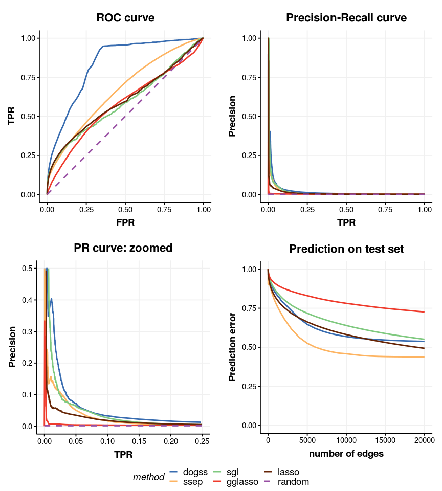

Network reconstruction with dogss: DREAM5
================
Edgar Steiger
2018

-   [ROC/PR analysis](#rocpr-analysis)
-   [different groupings](#different-groupings)

This document shows and explains how to use the dogss package and how to reproduce Figures 14 and 15 from our paper [Sparse-Group Bayesian Feature Selection Using Expectation Propagation for Signal Recovery and Network Reconstruction](https://arxiv.org/abs/1809.09367).

First we need to load some packages that are required for comparisons and plotting (please install if not available on your machine):

``` r
library(dogss) # our method for sparse-group Bayesian feature selection with EP
library(glmnet) # standard lasso
library(gglasso) # group lasso
library(SGL) # sparse-group lasso
library(MBSGS) # Bayesian feature selection with Gibbs sampling

library(ggplot2) # for nice plots
library(ggthemes) # for even nicer plots
library(grid); library(gridExtra) # to arrange plots pleasantly

library(reshape2) # to melt data into "tidy" long-format

library(DescTools) # for area computations (AUROC, AUPR)
```

Furthermore we need to load three R files with additional code:

``` r
source("../auxiliary_rfunctions/my_cvSGL.R") # proper cross validation for SGL package

source("../auxiliary_rfunctions/my_theme.R") # functions to adjust ggplots
```

Finally, we provide all of the results on our simulated data to reconstruct the plots from the publication. If you wish to re-do all of the simulations/calculations, change the following parameter to `TRUE` (only do this if you have access to multiple cores):

``` r
selfcompute <- FALSE
B <- 100 # number of simulations
ncores <- 50 # number of cores used for parallelization
```

ROC/PR analysis
---------------

``` r
  load("/project/dogss/tests_thesis/03_dream5_analysis/average_dream5_results_300_1.RData")
# FPR <- FPR[, 1:4]
# TPR <- TPR[, 1:4]
# PREC <- PREC[, 1:4]
colnames(FPR) <- methods #[1:4]
colnames(TPR) <- methods #[1:4]
colnames(PREC) <- methods #[1:4]
N <- dim(FPR)[1]
mygrid <- c(1:2000, 2:1450*1000+1)
myranks <- c(0:2000, 2000+1000*1:18)
data <- data.frame(method=melt(FPR[mygrid, ])[, 2], fpr=melt(FPR[mygrid, ])[, 3], tpr=melt(TPR[mygrid, ])[, 3], precision=melt(PREC[mygrid, ])[, 3])
data <- rbind(data, data.frame(method="random", fpr=c(0,0.25,1), tpr=c(0,0.25,1), precision=c(0.0014, 0.0014, 0.0014)))
data$method <- factor(data$method, levels = c(methods, "random"), ordered = TRUE)

colnames(PREDERROR) <- methods
rownames(PREDERROR) <- myranks
data_pred <- melt(PREDERROR)
data_pred$method <- factor(data_pred$method, levels = methods, ordered = TRUE)

Ed_palette_full <- Ed_palette
Ed_palette <- Ed_palette[c(1:5, 7)]

myROC <- ggplot(data, aes(x=fpr, y=tpr, color=method)) +
  geom_line(aes(linetype=method), size=1) +
  theme_Ed() +
  scale_colour_Ed() +
  scale_linetype_manual(values=c(rep("solid", 5), "dashed")) +
  # geom_segment(aes(x=0, y=0, xend=1, yend=1, colour="random"), linetype="dashed", colour=Ed_palette[7]) +
  labs(title= "ROC curve", x = "FPR", y = "TPR")

myPR <- ggplot(data, aes(x=tpr, y=precision, color=method)) +
  geom_line(aes(linetype=method), size=1) +
  theme_Ed() +
  scale_colour_Ed() +
  scale_linetype_manual(values=c(rep("solid", 5), "dashed")) +
  # geom_segment(aes(x=0, y=2055/N, xend=1, yend=2055/N, colour="random"), linetype="dashed", colour=Ed_palette[7]) +
  ylim(0,1) +
  labs(title= "Precision-Recall curve", x = "TPR", y = "Precision")

myPR_zoom <- ggplot(data, aes(x=tpr, y=precision, color=method)) +
  geom_line(aes(linetype=method), size=1) +
  theme_Ed() +
  scale_colour_Ed() +
  scale_linetype_manual(values=c(rep("solid", 5), "dashed")) +
  # geom_segment(aes(x=0, y=2055/N, xend=0.25, yend=2055/N, colour="random"), linetype="dashed", colour=Ed_palette[5]) +
  ylim(0, 0.5) +
  xlim(0, 0.25) +
  labs(title= "PR curve: zoomed", x = "TPR", y = "Precision")

myPred <- ggplot(data_pred, aes(x=rank, y=value, color=method)) +
  geom_line(size=1) +
  theme_Ed() +
  scale_colour_Ed() +
  ylim(0, max(PREDERROR)) +
  labs(title= "Prediction on test set", x = "number of edges", y = "Prediction error")

grid_arrange_shared_legend(myROC, myPR, myPR_zoom, myPred, ncol = 2, nrow = 2) #
```

    ## Warning: Removed 6724 rows containing missing values (geom_path).



``` r
Ed_palette <- Ed_palette_full
```

different groupings
-------------------

``` r
  load("/project/dogss/testing/withpred_dream5_withpred_diffgroups_whole_final.RData")
  old_FPR <- FPR[, 1]
  old_TPR <- TPR[, 1]
  old_PREC <- PREC[, 1]
  load("~/Programme/dogss/testing/dream5_withpred_diffgroups_whole_averaged_10.RData")
  FPR <- cbind(old_FPR, FPR)
  TPR <- cbind(old_TPR, TPR)
  PREC <- cbind(old_PREC, PREC)
  methods <- c("co-binding", "unif. random", "perm. groups", "kmeans")
  colnames(FPR) <- methods
  colnames(TPR) <- methods
  colnames(PREC) <- methods
  N <- dim(FPR)[1]
  mygrid <- c(1:2000, 2:1500*1000+1)
  data <- data.frame(method=melt(FPR[mygrid, ])[, 2], fpr=melt(FPR[mygrid, ])[, 3], tpr=melt(TPR[mygrid, ])[, 3], precision=melt(PREC[mygrid, ])[, 3])

  myROC <- ggplot(data, aes(x=fpr, y=tpr, color=method)) +
    geom_line(size=1.3) +
    theme_Ed() +
    scale_colour_Ed() +
    geom_segment(aes(x=0, y=0, xend=1, yend=1, colour="random"), linetype="dashed", colour=Ed_palette[5]) +
    labs(title= "ROC curve", x = "FPR", y = "TPR")

  myPR_zoom <- ggplot(data, aes(x=tpr, y=precision, color=method)) +
    geom_line(size=1.3) +
    theme_Ed() +
    scale_colour_Ed() +
    geom_segment(aes(x=0, y=2066/N, xend=0.25, yend=2066/N, colour="random"), linetype="dashed", colour=Ed_palette[5]) +
    ylim(0, 0.5) +
    xlim(0, 0.25) +
    labs(title= "PR curve: zoomed", x = "TPR", y = "Precision")

  grid_arrange_shared_legend(myROC, myPR_zoom, ncol = 2, nrow = 1)
```
