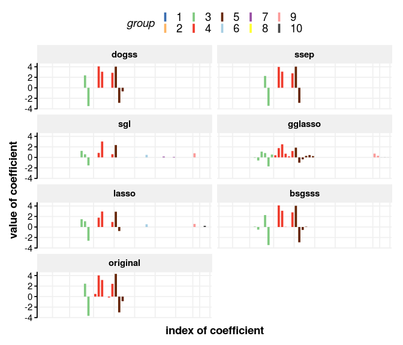
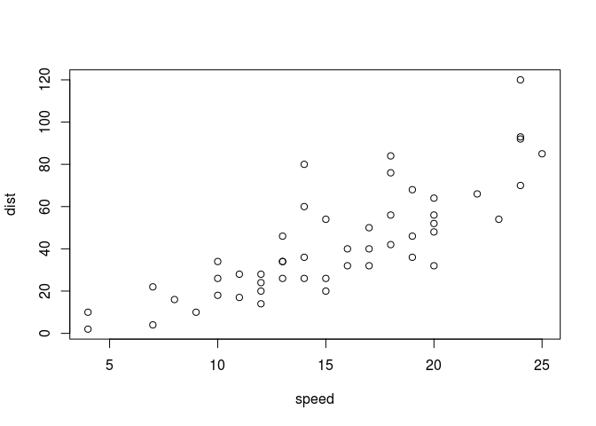

Signal recovery with dogss
================
Edgar Steiger
2018

-   [Needle plot](#needle-plot)
-   [Three scenarios for feature selection](#three-scenarios-for-feature-selection)
    -   [small](#small)
    -   [medium](#medium)
    -   [large](#large)
-   [Noise](#noise)
-   [Correlation structure](#correlation-structure)
-   [Slab parameter](#slab-parameter)
-   [sample file text](#sample-file-text)

This document shows and explains how to use the dogss package and how to reproduce Figures 2 to 8 from the paper (put reference here as a link).

First we need to load some packages that are required for comparisons and plotting (please install if not available on your machine):

``` r
library(dogss) # our method for sparse-group Bayesian feature selection with EP
library(glmnet) # standard lasso
library(gglasso) # group lasso
library(SGL) # sparse-group lasso
library(MBSGS) # Bayesian feature selection with Gibbs sampling

library(ggplot2) # for nice plots
library(ggthemes) # for even nicer plots
library(grid) # to arrange plots pleasantly

library(DescTools) # for area computations (AUROC, AUPR)
```

Furthermore we need to load three R files with additional code:

``` r
source("../auxiliary_rfunctions/my_BSGSSS.R") # MBSGS package has a problem with groups of size 1
source("../auxiliary_rfunctions/my_cvSGL.R") # SGL package does a weird cross validation, this is cv similar to gglasso/glmnet package

source("../auxiliary_rfunctions/my_theme.R") # functions to adjust ggplots
```

Needle plot
===========

contents (F2)

``` r
# parameters for the simulation:
  m <- 30
  p <- 50
  nG <- 10
  k <- 10
  sigma0 <- 1

  results <- list()
  betas <- rep(0, p)
  rss <- rep(0, 6)
  names(rss) <- c("dogss", "ssep", "lasso", "sgl", "gglasso", "bsgsss")

    set.seed(2670)

    G <- sample(1:nG, p, replace=TRUE)
    groups <- unique(G)
    ngroups <- length(groups)
    nngroups <- sapply(groups, function(g) sum(G==g))

    while (max(groups) != ngroups) { # this is for gglasso which needs consecutively numbered groups :-/
      del <- max(groups)
      G[G==del] <- which.min(1:nG %in% unique(G)) # this is superweird :D
      groups <- unique(G)
      ngroups <- length(groups)
      nngroups <- sapply(groups, function(g) sum(G==g))
    }

    G <- unlist(sapply(groups, function(g) rep(g, nngroups[which(groups==g)]))) # sort groups...
    G <- sort(G)
    groups <- unique(G)
    ngroups <- length(groups)
    nngroups <- sapply(groups, function(g) sum(G==g))

    x <- rnorm(m, 0, 1)
    X <- sapply(1:p, function(i) x+rnorm(m, 0, 1)) # this gives a matrix where variables/columns have pairwise correlation 0.5 on the population level
    X.sort <- matrix(unlist(sapply(groups, function(g) X[, G==g])), nrow=m)
    X <- X.sort
    threegroups <- sample(1:ngroups, 3)
    whichbeta <- which(G%in%threegroups)
    betas[sample(whichbeta, min(length(whichbeta), k))] <- runif(min(length(whichbeta), k), -5, 5) # exactly 3 non-zero groups
    Y <- as.vector(X %*% betas) + rnorm(m, 0, sigma0)

    results$dogss <- cv_dogss(X,Y,G)
    results$ssep <- cv_dogss(X,Y,G=NULL) 
    results$lasso <- cv.glmnet(x=X, y=Y, intercept=FALSE, standardize=FALSE)
    results$sgl <- my_cvSGL(data=list(x=X,y=Y),index=G, standardize=FALSE)
    results$gglasso <- cv.gglasso(x=X, y=Y, group=G, nfolds=10, intercept=FALSE)
    results$bsgsss <- BSGSSS(Y=Y, X=X, group_size=nngroups)

    ### lambdamin+1se rule:
    index_lasso <- which(results$lasso$lambda==results$lasso$lambda.1se)
    index_gglasso <- which(results$gglasso$lambda==results$gglasso$lambda.1se)

    rss[1] <- sum((results$dogss$m_cv - betas)^2)
    rss[2] <- sum((results$ssep$m_cv - betas)^2) 
    rss[3] <- sum((results$lasso$glmnet.fit$beta[, index_lasso] - betas)^2)
    rss[4] <- sum((results$sgl$beta - betas)^2)
    rss[5] <- sum((results$gglasso$gglasso.fit$beta[, index_gglasso] - betas)^2)
    rss[6] <- sum((results$bsgsss$pos_median - betas)^2)

    mydata_signal <- data.frame(
      index=rep(1:p, times=7),
      BETAS=c(
        results$dogss$m_cv, 
        results$ssep$m_cv, 
        results$sgl$beta,
        results$gglasso$gglasso.fit$beta[, index_gglasso], 
        results$lasso$glmnet.fit$beta[, index_lasso], 
        results$bsgsss$pos_median,
        betas
      ),
      G=as.factor(rep(G,times=7)),
      method=factor(rep(c("dogss", "ssep", "sgl" , "gglasso", "lasso", "bsgsss", "original"), each=p), levels=c("dogss", "ssep", "sgl" , "gglasso", "lasso", "bsgsss", "original"), ordered=TRUE)
    )

    ggplot(mydata_signal, aes(colour=G, x=index, ymax=BETAS, ymin=0)) +
      facet_wrap(~ method, nrow=4, ncol=2) +
      geom_linerange(size=1.3)  +
      scale_colour_manual(values=rep(Ed_palette,length.out=p)) +
      scale_x_continuous(breaks = c(0.5, cumsum(nngroups[1:(ngroups)])+0.5), expand=c(0,1)) +
      labs(colour = "group", x="index of coefficient", y="value of coefficient") +
      theme_Ed() + theme(plot.title = element_blank(), legend.position = "top", axis.text.x = element_blank(), axis.ticks.x = element_blank(), axis.line.x =element_blank())
```



Three scenarios for feature selection
=====================================

contents (F3-5)

small
-----

contents

medium
------

contents

large
-----

contents

Noise
=====

contents, F6

Correlation structure
=====================

contents, F7

Slab parameter
==============

contents, F8

sample file text
================

This is an [R Markdown](http://rmarkdown.rstudio.com) Notebook. When you execute code within the notebook, the results appear beneath the code.

Try executing this chunk by clicking the *Run* button within the chunk or by placing your cursor inside it and pressing *Ctrl+Shift+Enter*.

``` r
plot(cars)
```



Add a new chunk by clicking the *Insert Chunk* button on the toolbar or by pressing *Ctrl+Alt+I*.

When you save the notebook, an HTML file containing the code and output will be saved alongside it (click the *Preview* button or press *Ctrl+Shift+K* to preview the HTML file).

The preview shows you a rendered HTML copy of the contents of the editor. Consequently, unlike *Knit*, *Preview* does not run any R code chunks. Instead, the output of the chunk when it was last run in the editor is displayed.
