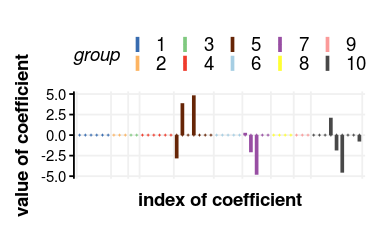

Signal recovery with dogss
================
Edgar Steiger
2018

-   [Simulation](#simulation)
-   [Comparison of methods - Needle plot](#comparison-of-methods---needle-plot)
-   [Three scenarios for feature selection](#three-scenarios-for-feature-selection)
    -   [small](#small)
    -   [medium](#medium)
    -   [large](#large)
-   [Noise](#noise)
-   [Correlation structure](#correlation-structure)
-   [Slab parameter](#slab-parameter)

This document shows and explains how to use the dogss package and how to reproduce Figures 2 to 8 from the paper (put reference here as a link).

First we need to load some packages that are required for comparisons and plotting (please install if not available on your machine):

``` r
library(dogss) # our method for sparse-group Bayesian feature selection with EP
library(glmnet) # standard lasso
library(gglasso) # group lasso
library(SGL) # sparse-group lasso
library(MBSGS) # Bayesian feature selection with Gibbs sampling

library(ggplot2) # for nice plots
library(ggthemes) # for even nicer plots
library(grid) # to arrange plots pleasantly

library(DescTools) # for area computations (AUROC, AUPR)
```

Furthermore we need to load three R files with additional code:

``` r
source("../auxiliary_rfunctions/my_BSGSSS.R") # MBSGS package has a problem with groups of size 1
source("../auxiliary_rfunctions/my_cvSGL.R") # proper cross validation for SGL package

source("../auxiliary_rfunctions/my_theme.R") # functions to adjust ggplots
```

Simulation
----------

We show how to simulate data for signal recovery. This data will be used in the next section.

First we set the parameters for simulation:

``` r
m <- 30; p <- 50; nG <- 10; nzG <- 3; k <- 10; sigma0 <- 1
```

Here **m** is the number of observations, **p** is the number of features, **nG** is the number of groups, **k** is the number of non-zero coefficients and **sigma0** refers to the noise we will add in the end.

The next chunk will be a function that simulates the data for the linear model **Y=X\*beta+epsilon** with grouped variables. The groups are sampled such that there are exactly **nG** groups (sampling repeated until condition met). The data matrix **X** consists of values sampled from a standard normal distribution. The non-zero entries of the coefficient vector **beta** are sampled from a uniform distribution on (-5,5).

``` r
sim_signalrecovery <- function(m, p, nG, nzG, k, sigma0) {
  beta <- rep(0, p)
  G <- sort(sample(1:nG, p, replace=TRUE))
  while (sum(!(1:nG %in% G)) > 0) { # this makes sure we have exactly nG groups
    G <- sort(sample(1:nG, p, replace=TRUE))
  }
  
  X <- matrix(rnorm(m*p, 0, 1), nrow=m, ncol=p)
  nzgroups <- sample(1:nG, nzG) # we sample the non-zero groups
  whichbeta <- which(G%in%nzgroups) # get the indices of the non-zero groups
  beta[sample(whichbeta, min(length(whichbeta), k))] <- runif(min(length(whichbeta), k), -5, 5) # assign random values to k indices in the non-zero groups
  Y <- as.vector(X %*% beta) + rnorm(m, 0, sigma0) # final linear model
  sim <- list(Y=Y, X=X, beta=beta, G=G)
  return(sim)
}
```

It might happen that we have less than **k** non-zero coefficients if the **nzG** non-zero groups have together less than **k** elements. Here is an example simulation with this function and the parameters defined above:

``` r
sim <- sim_signalrecovery(m, p, nG, nzG, k, sigma0)

X <- sim$X; Y <- sim$Y; beta <- sim$beta; G <- sim$G
sizegroups <- sapply(1:nG, function(g) sum(G==g)) # we will need the group sizes for plotting

example_signal <- data.frame(index=1:p, beta=beta, G=as.factor(G))

ggplot(example_signal, aes(colour=G, x=index, ymax=beta, ymin=0)) +
  geom_linerange(size=1.3)  +
  geom_point(aes(x=index, y=0), shape=3, size=0.2) +
  scale_colour_manual(values=rep(Ed_palette,length.out=p)) +
  scale_x_continuous(breaks = c(0.5, cumsum(sizegroups[1:(nG)])+0.5), expand=c(0,1)) +
  labs(colour = "group", x="index of coefficient", y="value of coefficient") +
  theme_Ed() + theme(plot.title = element_blank(), legend.position = "top", axis.text.x = element_blank(), axis.ticks.x = element_blank(), axis.line.x =element_blank())
```



The plot shows the original coefficient vector **beta** (indexed along the x-axis), every group of coefficients with a separate colour, and the height of a bar gives the value of the coefficient on the y-axis (this is called a needle plot).

Comparison of methods - Needle plot
-----------------------------------

Next we will run six different methods on our simulated data **X**, **Y**, **G** to reconstruct the coefficient vector. Please note that **BSGSSS** because of Gibbs sampling needs a few minutes to run on a standard machine:

``` r
results <- list()
  
results$dogss <- cv_dogss(X,Y,G)
results$ssep <- cv_dogss(X,Y,G=NULL) 
results$lasso <- cv.glmnet(x=X, y=Y, intercept=FALSE, standardize=FALSE)
results$sgl <- my_cvSGL(data=list(x=X,y=Y),index=G, standardize=FALSE)
results$gglasso <- cv.gglasso(x=X, y=Y, group=G, nfolds=10, intercept=FALSE)
results$bsgsss <- my_BSGSSS(Y=Y, X=X, group_size=sizegroups)
```

Finally we will plot all of the reconstructed coefficient vectors together with the original one, this is Figure 2 from the paper:

``` r
mydata_signal <- data.frame(
  index=rep(1:p, times=7),
  BETAS=c(
    results$dogss$m_cv, 
    results$ssep$m_cv, 
    results$sgl$beta,
    results$gglasso$gglasso.fit$beta[, which(results$gglasso$lambda==results$gglasso$lambda.1se)], 
    results$lasso$glmnet.fit$beta[, which(results$lasso$lambda==results$lasso$lambda.1se)], 
    results$bsgsss$pos_median,
    beta
  ),
  G=as.factor(rep(G,times=7)),
  method=factor(rep(c("dogss", "ssep", "sgl" , "gglasso", "lasso", "bsgsss", "original"), each=p), levels=c("dogss", "ssep", "sgl" , "gglasso", "lasso", "bsgsss", "original"), ordered=TRUE)
)

ggplot(mydata_signal, aes(colour=G, x=index, ymax=BETAS, ymin=0)) +
  facet_wrap(~ method, nrow=4, ncol=2) +
  geom_linerange(size=1.3)  +
  geom_point(aes(x=index, y=0), shape=3, size=0.2) +
  scale_colour_manual(values=rep(Ed_palette,length.out=p)) +
  scale_x_continuous(breaks = c(0.5, cumsum(sizegroups[1:(nG)])+0.5), expand=c(0,1)) +
  labs(colour = "group", x="index of coefficient", y="value of coefficient") +
  theme_Ed() + theme(plot.title = element_blank(), legend.position = "top", axis.text.x = element_blank(), axis.ticks.x = element_blank(), axis.line.x =element_blank())
```


Three scenarios for feature selection
-------------------------------------

contents (F3-5)

### small

contents

### medium

contents

### large

contents

Noise
-----

contents, F6

Correlation structure
---------------------

contents, F7

Slab parameter
--------------

contents, F8
