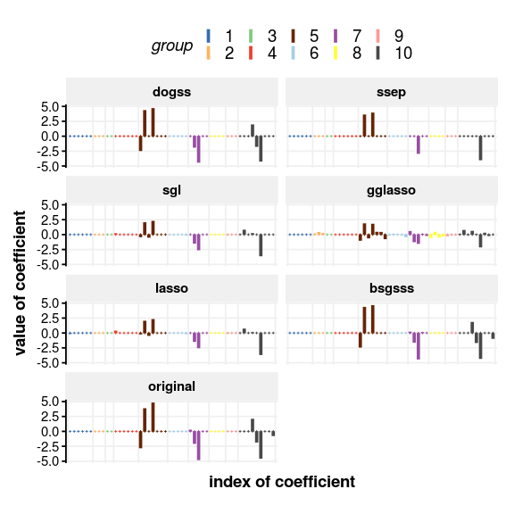
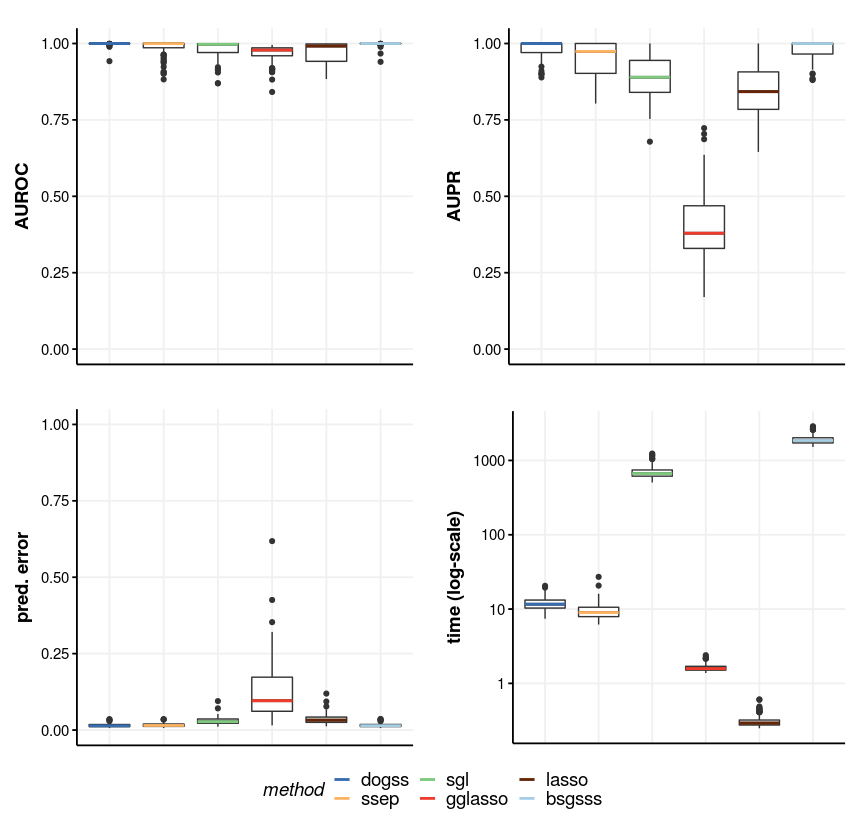

Signal recovery with dogss
================
Edgar Steiger
2018

-   [Simulation](#simulation)
-   [Comparison of methods - Needle plot](#comparison-of-methods---needle-plot)
-   [Three scenarios for feature selection](#three-scenarios-for-feature-selection)
    -   [small](#small)
    -   [medium](#medium)
    -   [large](#large)
-   [Noise](#noise)
-   [Correlation structure](#correlation-structure)
-   [Slab parameter](#slab-parameter)

This document shows and explains how to use the dogss package and how to reproduce Figures 2 to 8 from the paper (put reference here as a link).

First we need to load some packages that are required for comparisons and plotting (please install if not available on your machine):

``` r
library(dogss) # our method for sparse-group Bayesian feature selection with EP
library(glmnet) # standard lasso
library(gglasso) # group lasso
library(SGL) # sparse-group lasso
library(MBSGS) # Bayesian feature selection with Gibbs sampling

library(ggplot2) # for nice plots
library(ggthemes) # for even nicer plots
library(grid); library(gridExtra) # to arrange plots pleasantly

library(reshape2) # to melt data into "tidy" long-format

library(DescTools) # for area computations (AUROC, AUPR)
```

Furthermore we need to load three R files with additional code:

``` r
source("../auxiliary_rfunctions/my_BSGSSS.R") # MBSGS package has a problem with groups of size 1
source("../auxiliary_rfunctions/my_cvSGL.R") # proper cross validation for SGL package

source("../auxiliary_rfunctions/my_theme.R") # functions to adjust ggplots
```

Simulation
----------

We show how to simulate data for signal recovery. This data will be used in the next section.

First we set the parameters for simulation:

``` r
m <- 30; p <- 50; nG <- 10; nzG <- 3; k <- 10; sigma0 <- 1
```

Here **m** is the number of observations, **p** is the number of features, **nG** is the number of groups, **k** is the number of non-zero coefficients and **sigma0** refers to the noise we will add in the end.

The next chunk will be a function that simulates the data for the linear model **Y=X\*beta+epsilon** with grouped variables. The groups are sampled such that there are exactly **nG** groups (sampling repeated until condition met). The data matrix **X** consists of values sampled from a standard normal distribution. The non-zero entries of the coefficient vector **beta** are sampled from a uniform distribution on (-5,5).

``` r
sim_signalrecovery <- function(m, p, nG, nzG, k, sigma0) {
  beta <- rep(0, p)
  G <- sort(sample(1:nG, p, replace=TRUE))
  while (sum(!(1:nG %in% G)) > 0) { # this makes sure we have exactly nG groups
    G <- sort(sample(1:nG, p, replace=TRUE))
  }
  
  X <- matrix(rnorm((m+100)*p, 0, 1), nrow=m+100, ncol=p)
  nzgroups <- sample(1:nG, nzG) # we sample the non-zero groups
  whichbeta <- which(G%in%nzgroups) # get the indices of the non-zero groups
  beta[sample(whichbeta, min(length(whichbeta), k))] <- runif(min(length(whichbeta), k), -5, 5) # assign random values to k indices in the non-zero groups
  Y <- as.vector(X %*% beta) + rnorm(m+100, 0, sigma0) # final linear model
  sim <- list(Y=Y[1:m], X=X[1:m, ], beta=beta, G=G, Y.test=Y[(m+1):(m+100)], X.test=X[(m+1):(m+100), ])
  return(sim)
}
```

It might happen that we have less than **k** non-zero coefficients if the **nzG** non-zero groups have together less than **k** elements. Here is an example simulation with this function and the parameters defined above:

``` r
set.seed(7042)
sim <- sim_signalrecovery(m, p, nG, nzG, k, sigma0)

X <- sim$X; Y <- sim$Y; beta <- sim$beta; G <- sim$G
sizegroups <- sapply(1:nG, function(g) sum(G==g)) # we will need the group sizes for plotting

example_signal <- data.frame(index=1:p, beta=beta, G=as.factor(G))

ggplot(example_signal, aes(colour=G, x=index, ymax=beta, ymin=0)) +
  geom_linerange(size=1.3)  +
  geom_point(aes(x=index, y=0), shape=3, size=0.2) +
  scale_colour_manual(values=rep(Ed_palette,length.out=p)) +
  scale_x_continuous(breaks = c(0.5, cumsum(sizegroups[1:(nG)])+0.5), expand=c(0,1)) +
  labs(colour = "group", x="index of coefficient", y="value of coefficient") +
  theme_Ed() + theme(plot.title = element_blank(), legend.position = "top", axis.text.x = element_blank(), axis.ticks.x = element_blank(), axis.line.x =element_blank())
```


The plot shows the original coefficient vector **beta** (indexed along the x-axis), every group of coefficients with a separate colour, and the height of a bar gives the value of the coefficient on the y-axis (this is called a needle plot).

Comparison of methods - Needle plot
-----------------------------------

Next we will run six different methods on our simulated data **X**, **Y**, **G** to reconstruct the coefficient vector. Please note that **BSGSSS** because of Gibbs sampling needs a few minutes to run on a standard machine:

``` r
results <- list()
  
results$dogss <- cv_dogss(X,Y,G)
results$ssep <- cv_dogss(X,Y,G=NULL) 
results$lasso <- cv.glmnet(x=X, y=Y, intercept=FALSE, standardize=FALSE)
results$sgl <- my_cvSGL(data=list(x=X,y=Y),index=G, standardize=FALSE)
results$gglasso <- cv.gglasso(x=X, y=Y, group=G, nfolds=10, intercept=FALSE)
results$bsgsss <- my_BSGSSS(Y=Y, X=X, group_size=sizegroups)
```

Finally we will plot all of the reconstructed coefficient vectors together with the original one, this is Figure 2 from the paper:

``` r
mydata_signal <- data.frame(
  index=rep(1:p, times=7),
  BETAS=c(
    results$dogss$m_cv, 
    results$ssep$m_cv, 
    results$sgl$beta,
    results$gglasso$gglasso.fit$beta[, which(results$gglasso$lambda==results$gglasso$lambda.1se)], 
    results$lasso$glmnet.fit$beta[, which(results$lasso$lambda==results$lasso$lambda.1se)], 
    results$bsgsss$pos_median,
    beta
  ),
  G=as.factor(rep(G,times=7)),
  method=factor(rep(c("dogss", "ssep", "sgl" , "gglasso", "lasso", "bsgsss", "original"), each=p), levels=c("dogss", "ssep", "sgl" , "gglasso", "lasso", "bsgsss", "original"), ordered=TRUE)
)

ggplot(mydata_signal, aes(colour=G, x=index, ymax=BETAS, ymin=0)) +
  facet_wrap(~ method, nrow=4, ncol=2) +
  geom_linerange(size=1.3)  +
  geom_point(aes(x=index, y=0), shape=3, size=0.2) +
  scale_colour_manual(values=rep(Ed_palette,length.out=p)) +
  scale_x_continuous(breaks = c(0.5, cumsum(sizegroups[1:(nG)])+0.5), expand=c(0,1)) +
  labs(colour = "group", x="index of coefficient", y="value of coefficient") +
  theme_Ed() + theme(plot.title = element_blank(), legend.position = "top", axis.text.x = element_blank(), axis.ticks.x = element_blank(), axis.line.x =element_blank())
```



Three scenarios for feature selection
-------------------------------------

Now we will consider three different scenarios for the signal recovery (that is, three different sets of parameters). We will repeat the procedure above for all three sets of parameters, but for each set also repeat 100 times and aggregate the results. Aggregation is done along the AUROC and AUPR measure which are based on the rates of truely/falsely recovered edges, see paper for more detailed explanation, and the computing time needed for calculations, as well as the predictive performance on an additional simulated 100 data points with the same vector of coefficients.

**nzG=3** and **sigma0=1** in all three scenarios.

``` r
nzG <- 3; sigma0 <- 1
```

Please note that these codes will run for long times (mostly because of the Gibbs sampling based **BSGSSS** method), and as such I strongly recommend that you use parallelization, which I implemented using the following packages:

``` r
library(foreach)
library(doParallel)

B <- 100 # number of simulations
ncores <- 50 # number of cores used for parallelization
```

Furthermore I specified the number of simulations (**B**) and the number of cores (**ncores**) for the parallelization.

To generate the data of many simulations with parallelization we will use the following function:

``` r
parallel_signalrecovery <- function(m, p, nG, nzG, k, sigma0, ncores, B) {
  
  ncl <- detectCores()
  ncl <- min(ncl, ncores)
  
  myCluster <- makeCluster(ncl)
  registerDoParallel(myCluster)
  
  results <- foreach (b=1:B, .packages=c("dogss", "gglasso", "SGL", "glmnet", "MBSGS", "DescTools")) %dopar% {
    sim <- sim_signalrecovery(m, p, nG, nzG, k, sigma0)
    
    X <- sim$X; Y <- sim$Y; beta <- sim$beta; G <- sim$G
    sizegroups <- sapply(1:nG, function(g) sum(G==g)) # we will need the group sizes for BSGSSS
    
    # test data for the prediction
    X.test <- sim$X.test
    Y.test <- sim$Y.test
    
    # calculate lambda path to make the lasso approaches comparable (based on standard lasso):
    lambda_max <- max(abs(colSums(X*Y)))/m
    lambdapath <- round(exp(seq(log(lambda_max), log(lambda_max*0.0001),
                                length.out = 100)), digits = 10)
    
    times <- rep(0, 6)
    names(times) <- c("dogss", "ssep", "sgl", "gglasso", "lasso", "bsgsss") 
    
    # run all 6 methods while saving their computing time
    times["dogss"] <- system.time(results_dogss <- cv_dogss(X,Y,G))[1] 
    times["ssep"] <- system.time(results_ssep <- cv_dogss(X,Y,G=NULL))[1] 
    times["sgl"] <- system.time(results_sgl <- my_cvSGL(data=list(x=X,y=Y),index=G, standardize=FALSE, lambdas = lambdapath, thresh=thresh, maxit=maxit_lassos))[1]
    times["gglasso"] <- system.time(results_gglasso <- cv.gglasso(x=X, y=Y, group=G, nfolds=10, intercept=FALSE, lambda = lambdapath, eps=thresh, maxit=maxit_lassos))[1] 
    times["lasso"] <- system.time(results_lasso <- cv.glmnet(x=X, y=Y, intercept=FALSE, standardize=FALSE, lambda = lambdapath, thresh=thresh, maxit=maxit_lassos))[1] 
    times["bsgsss"] <- system.time(results_bsgsss <- my_BSGSSS(Y=Y, X=X, group_size=nngroups))[1]
    
    TPR <- matrix(0, nrow=length(G), ncol=6, dimnames=list(nfeat=1:length(G), method=c("dogss", "ssep", "sgl", "gglasso", "lasso", "bsgsss")))
    FPR <- matrix(0, nrow=length(G), ncol=6, dimnames=list(nfeat=1:length(G), method=c("dogss", "ssep", "sgl", "gglasso", "lasso", "bsgsss")))
    Prec <- matrix(0, nrow=length(G), ncol=6, dimnames=list(nfeat=1:length(G), method=c("dogss", "ssep", "sgl", "gglasso", "lasso", "bsgsss")))
    
    rankedlist <- matrix(0, nrow=length(G), ncol=6, dimnames=list(nfeat=1:length(G), method=c("dogss", "ssep", "sgl", "gglasso", "lasso", "bsgsss")))
    
    # get the ranked lists of coefficients along their probabilities (dogss, ssep, bsgsss) or lambda values (lasso, gglasso, sgl)
    rankedlist[, "dogss"] <- rank(1-results_dogss$p_final, ties="min")
    rankedlist[, "ssep"] <- rank(1-results_ssep$p_final, ties="min")
    rankedlist[, "sgl"] <- rank(apply(results_sgl$fit$beta, 1, function(b) ifelse(sum(b!=0)!=0, which.max(b!=0), Inf)), ties.method="min")
    rankedlist[, "gglasso"] <- rank(apply(results_gglasso$gglasso.fit$beta, 1, function(b) ifelse(sum(b!=0)!=0, which.max(b!=0), Inf)), ties.method="min")
    rankedlist[, "lasso"] <- rank(apply(results_lasso$glmnet.fit$beta, 1, function(b) ifelse(sum(b!=0)!=0, which.max(b!=0), Inf)), ties.method="min")
    rankedlist[, "bsgsss"] <- rank(1-results_bsgsss$p_final, ties="min")
    
    # true/false positive rates and precision are calculated along the ranked list of coeffcients versus the gold standard (beta)
    for (r in 1:dim(rankedlist)[1]) {
      TPR[r, ] <- apply(rankedlist, 2, function(s) sum(beta[s<=r]!=0))
      FPR[r, ] <- apply(rankedlist, 2, function(s) sum(beta[s<=r]==0))
      Prec[r, ] <- TPR[r, ]/apply(rankedlist, 2, function(s) sum(s<=r))
    }
    TPR <- TPR/sum(beta!=0)
    FPR <- FPR/sum(beta==0)
    
    # function AUC from DescTools calculates the Area Under the ROC or PR curve:
    AUROC <- sapply(c("dogss", "ssep", "sgl", "gglasso", "lasso", "bsgsss"), function(m) AUC(c(0,FPR[, m],1), c(0,TPR[, m],1)))
    AUPR <- sapply(c("dogss", "ssep", "sgl", "gglasso", "lasso", "bsgsss"), function(m) AUC(c(0,TPR[, m],1), c(1,Prec[, m],0)))
    
    # calculate pred error of Y on test data with the cross validated coefficient vectors:
    prederror <- rep(0, 6)
    names(prederror) <- c("dogss", "ssep", "sgl", "gglasso", "lasso", "bsgsss")
    normY.test <- sum(Y.test^2)
    prederror["dogss"] <- sum((X.test%*%results_dogss$m_cv-Y.test)^2)/normY.test
    prederror["ssep"] <- sum((X.test%*%results_ssep$m_cv-Y.test)^2)/normY.test
    prederror["sgl"] <- sum((X.test%*%results_sgl$beta-Y.test)^2)/normY.test
    prederror["gglasso"] <- sum((X.test%*%results_gglasso$gglasso.fit$beta[, which(results_gglasso$lambda==results_gglasso$lambda.1se)]-Y.test)^2)/normY.test
    prederror["lasso"] <- sum((X.test%*%results_lasso$glmnet.fit$beta[, which(results_lasso$lambda==results_lasso$lambda.1se)]-Y.test)^2)/normY.test
    prederror["bsgsss"] <- sum((X.test%*%results_bsgsss$pos_median-Y.test)^2)/normY.test
    
    list(AUROC=AUROC, AUPR=AUPR, prederror=prederror, times=times)
  }
  
  stopCluster(myCluster)
  
  return(results)
}
```

I provide the necessary data from my simulations to reconstruct the publication's plots. I will give the code that generated this data, but this code is marked to not be evaluated in this markdown file, instead only the side-loading of the RData-files is enabled. Feel free to re-run the generating code chunks on your local cluster!

Here we will compare the different methods on three different problems. This code generated the necessary data for the plots (again, this code is set to *not* be evaluated within this markdown file):

``` r
results_sr <- list()
results_sr[[1]] <- parallel_signalrecovery(m=30, p=30, nG=5, nzG=nzG, k=5, sigma0=sigma0, ncores=ncores, B=B)
results_sr[[2]] <- parallel_signalrecovery(m=30, p=100, nG=20, nzG=nzG, k=10, sigma0=sigma0, ncores=ncores, B=B)
results_sr[[3]] <- parallel_signalrecovery(m=100, p=1000, nG=100, nzG=nzG, k=10, sigma0=sigma0, ncores=ncores, B=B)
```

Instead, we load the data:

``` r
load("results_sr_sml.RData")
```

This is the code that generates Figures 3, 4 and 5:

``` r
plot_sml <- function(sml) {
  auroc <- matrix(0, nrow=B, ncol=6, dimnames=list(run=1:B, method=names(results_sr[[sml]][[1]]$AUROC)))
  aupr <- auroc
  prederror <- matrix(0, nrow=B, ncol=6, dimnames=list(run=1:B, method=names(results_sr[[sml]][[1]]$prederror)))
  times <- matrix(0, nrow=B, ncol=6, dimnames=list(run=1:B, method=names(results_sr[[sml]][[1]]$times)))
  
  for (b in 1:B) {
    auroc[b, ] <- results_sr[[sml]][[b]]$AUROC
    aupr[b, ] <- results_sr[[sml]][[b]]$AUPR
    prederror[b, ] <- results_sr[[sml]][[b]]$prederror
    times[b, ] <- results_sr[[sml]][[b]]$times
  }
  
  data <- data.frame(melt(auroc), measure="auroc")
  data <- rbind(data, data.frame(melt(aupr), measure="aupr"))
  data <- rbind(data, data.frame(melt(prederror), measure="prederror"))
  data <- rbind(data, data.frame(melt(times), measure="times"))
  data$method <- factor(data$method, ordered=TRUE, levels=c("dogss", "ssep", "sgl", "gglasso", "lasso", "bsgsss"))
  
  auroc_data <- subset(data, measure=="auroc")
  P_auroc <- ggplot(auroc_data, aes(x=method, y=value)) +
    geom_boxplot() +
    theme_Ed() +
    scale_colour_Ed() +
    ylim(0,1) +
    labs(y="AUROC") +
    theme(axis.title.x=element_blank(),
          axis.text.x=element_blank(),
          axis.ticks.x=element_blank())
  Pd_auroc <- ggplot_build(P_auroc)$data[[1]]
  P_auroc <- P_auroc + geom_segment(data=Pd_auroc, aes(x=xmin, xend=xmax, y=middle, yend=middle, colour=unique(data$method)), size=1) + labs(colour="method")
  
  aupr_data <- subset(data, measure=="aupr")
  P_aupr <- ggplot(aupr_data, aes(x=method, y=value)) +
    geom_boxplot() +
    theme_Ed() +
    scale_colour_Ed() +
    ylim(0,1) +
    labs(y="AUPR") +
    theme(axis.title.x=element_blank(),
          axis.text.x=element_blank(),
          axis.ticks.x=element_blank())
  Pd_aupr <- ggplot_build(P_aupr)$data[[1]]
  P_aupr <- P_aupr + geom_segment(data=Pd_aupr, aes(x=xmin, xend=xmax, y=middle, yend=middle, colour=unique(data$method)), size=1) + labs(colour="method")
  
  prederror_data <- subset(data, measure=="prederror")
  P_prederror <- ggplot(prederror_data, aes(x=method, y=value)) +
    geom_boxplot() +
    theme_Ed() +
    scale_colour_Ed() +
    scale_y_continuous(breaks=c(0, 0.25, 0.5, 0.75, 1), limits=c(0, max(1, max(prederror)))) +
    # scale_y_log10() +
    labs(y="pred. error") +
    theme(axis.title.x=element_blank(),
          axis.text.x=element_blank(),
          axis.ticks.x=element_blank())
  Pd_prederror <- ggplot_build(P_prederror)$data[[1]]
  P_prederror <- P_prederror + geom_segment(data=Pd_prederror, aes(x=xmin, xend=xmax, y=middle, yend=middle, colour=unique(data$method)), size=1) + labs(colour="method")
  
  times_data <- subset(data, measure=="times")
  P_times <- ggplot(times_data, aes(x=method, y=value)) +
    geom_boxplot() +
    theme_Ed() +
    scale_colour_Ed() +
    labs(y="time (log-scale)") +
    theme(axis.title.x=element_blank(),
          axis.text.x=element_blank(),
          axis.ticks.x=element_blank())
  Pd_times <- ggplot_build(P_times)$data[[1]]
  P_times <- P_times + geom_segment(data=Pd_times, aes(x=xmin, xend=xmax, y=middle, yend=middle, colour=unique(data$method)), size=1) + labs(colour="method") + scale_y_log10() 
  
  grid_arrange_shared_legend(P_auroc, P_aupr, P_prederror, P_times, ncol = 2, nrow = 2, which.legend = 4)
}
```

### small

Here **m=30** (number of observations), **p=30** (number of features), **nG=5** (number of groups), **k=5** (number of non-zero coefficients). Figure 3:

``` r
plot_sml(1)
```


### medium

Here **m=30** (number of observations), **p=100** (number of features), **nG=20** (number of groups), **k=10** (number of non-zero coefficients). Figure 4:

``` r
plot_sml(2)
```


### large

Here **m=10** (number of observations), **p=1000** (number of features), **nG=100** (number of groups), **k=10** (number of non-zero coefficients). Figure 5:

``` r
plot_sml(3)
```



Noise
-----

Next we analyze how sensitive the methods are in regards to the noise level.

``` r
m <- 30; p <- 100; nG <- 20; nzG <- 3; k <- 10

results_noise <- list()
results_noise[[1]] <- parallel_signalrecovery(m=m, p=p, nG=nG, nzG=nzG, k=k, sigma0=0, ncores=ncores, B=B)
results_noise[[2]] <- parallel_signalrecovery(m=m, p=p, nG=nG, nzG=nzG, k=k, sigma0=0.1, ncores=ncores, B=B)
results_noise[[3]] <- parallel_signalrecovery(m=m, p=p, nG=nG, nzG=nzG, k=k, sigma0=1, ncores=ncores, B=B)
results_noise[[4]] <- parallel_signalrecovery(m=m, p=p, nG=nG, nzG=nzG, k=k, sigma0=3, ncores=ncores, B=B)
results_noise[[5]] <- parallel_signalrecovery(m=m, p=p, nG=nG, nzG=nzG, k=k, sigma0=5, ncores=ncores, B=B)
```

``` r
load("results_sr_noise.RData")
```

``` r
auroc_noise <- matrix(0, nrow=5, ncol=6, dimnames=list(noise=c(0, 0.1, 1, 3, 5), method=c("dogss", "ssep", "sgl", "gglasso", "lasso", "bsgsss")))
aupr_noise <- matrix(0, nrow=5, ncol=6, dimnames=list(noise=c(0, 0.1, 1, 3, 5), method=c("dogss", "ssep", "sgl", "gglasso", "lasso", "bsgsss")))
prederror_noise <- matrix(0, nrow=5, ncol=6, dimnames=list(noise=c(0, 0.1, 1, 3, 5), method=c("dogss", "ssep", "sgl", "gglasso", "lasso", "bsgsss")))
times_noise <- matrix(0, nrow=5, ncol=6, dimnames=list(noise=c(0, 0.1, 1, 3, 5), method=c("dogss", "ssep", "sgl", "gglasso", "lasso", "bsgsss")))
for (i in 1:5) {
  auroc <- matrix(0, nrow=100, ncol=6)
  colnames(auroc) <- names(results_noise[[i]][[1]]$AUROC)
  aupr <- auroc
  prederror <- matrix(0, nrow=100, ncol=6)
  colnames(prederror) <- names(results_noise[[i]][[1]]$prederror)
  times <- matrix(0, nrow=100, ncol=6)
  colnames(times) <- names(results_noise[[i]][[1]]$times)
  
  for (b in 1:B) {
    auroc[b, ] <- results_noise[[i]][[b]]$AUROC
    aupr[b, ] <- results_noise[[i]][[b]]$AUPR
    prederror[b, ] <- results_noise[[i]][[b]]$prederror
    times[b, ] <- results_noise[[i]][[b]]$times
  }
  auroc_noise[i, ] <- apply(auroc, 2, median)
  aupr_noise[i, ] <- apply(aupr, 2, median)
  prederror_noise[i, ] <- apply(prederror, 2, median)
  times_noise[i, ] <- apply(times, 2, median)
}

data <- rbind(data.frame(melt(auroc_noise), measure=rep("auroc", length(auroc_noise))), data.frame(melt(aupr_noise), measure=rep("aupr", length(aupr_noise))), data.frame(melt(prederror_noise), measure=rep("prederror", length(prederror_noise))), data.frame(melt(times_noise), measure=rep("times", length(times_noise))))
data$method <- factor(data$method, ordered=TRUE, levels=c("dogss", "ssep", "sgl", "gglasso", "lasso", "bsgsss"))

auroc_data <- subset(data, measure=="auroc")
P_auroc <- ggplot(auroc_data, aes(x=as.factor(noise), y=value, group=method, colour=method)) +
  geom_line(size=1, position = position_dodge(0.01)) +
  ylim(0, 1) +
  theme_Ed() +
  scale_colour_Ed() +
  labs(x="noise", y="AUROC", colour="Method")

aupr_data <- subset(data, measure=="aupr")
P_aupr <- ggplot(aupr_data, aes(x=as.factor(noise), y=value, group=method, colour=method)) +
  geom_line(size=1, position = position_dodge(0.01)) +
  ylim(0, 1) +
  theme_Ed() +
  scale_colour_Ed() +
  labs(x="noise", y="AUPR", colour="Method")

prederror_data <- subset(data, measure=="prederror")
P_prederror <- ggplot(prederror_data, aes(x=as.factor(noise), y=value, group=method, colour=method)) +
  geom_line(size=1, position = position_dodge(0.01)) +
  ylim(0, max(prederror_noise)) +
  theme_Ed() +
  scale_colour_Ed() +
  labs(x="noise", y="pred. error", colour="Method")

times_data <- subset(data, measure=="times")
P_times <- ggplot(times_data, aes(x=as.factor(noise), y=value, group=method, colour=method)) +
  geom_line(size=1, position = position_dodge(0.01)) +
  theme_Ed() +
  scale_colour_Ed() +
  scale_y_log10() +
  labs(x="noise", y="times (log-scale)", colour="Method")

grid_arrange_shared_legend(P_auroc, P_aupr, P_prederror, P_times, ncol = 2, nrow = 2, which.legend = 4)
```


Correlation structure
---------------------

Next we analyze how sensitive the methods are in regards to the correlation structure of the variables. The first correlation structure is the one that we already employed above, where all features are independent of each other. The second correlation structure is such that all features have a pairwise correlation fixed at 0.5. Finally, the third correlation structure is based on the group membership of features, meaning that features within the same group have a pairwise correlation of 0.5, while features from pairwise different groups have no correlation.

First we define two new functions which simulate new data (one for pairwise and one for groupwise correlation):

``` r
sim_sr_pw <- function(m, p, nG, nzG, k, sigma0) {
  beta <- rep(0, p)
  G <- sort(sample(1:nG, p, replace=TRUE))
  while (sum(!(1:nG %in% G)) > 0) { # this makes sure we have exactly nG groups
    G <- sort(sample(1:nG, p, replace=TRUE))
  }
  
  X <- matrix(rnorm(m*p, 0, 1), nrow=m, ncol=p)
  nzgroups <- sample(1:nG, nzG) # we sample the non-zero groups
  whichbeta <- which(G%in%nzgroups) # get the indices of the non-zero groups
  beta[sample(whichbeta, min(length(whichbeta), k))] <- runif(min(length(whichbeta), k), -5, 5) # assign random values to k indices in the non-zero groups
  Y <- as.vector(X %*% beta) + rnorm(m, 0, sigma0) # final linear model
  sim <- list(Y=Y, X=X, beta=beta, G=G)
  return(sim)
}

sim_sr_gw <- function(m, p, nG, nzG, k, sigma0) {
  beta <- rep(0, p)
  G <- sort(sample(1:nG, p, replace=TRUE))
  while (sum(!(1:nG %in% G)) > 0) { # this makes sure we have exactly nG groups
    G <- sort(sample(1:nG, p, replace=TRUE))
  }
  
  X <- matrix(rnorm(m*p, 0, 1), nrow=m, ncol=p)
  nzgroups <- sample(1:nG, nzG) # we sample the non-zero groups
  whichbeta <- which(G%in%nzgroups) # get the indices of the non-zero groups
  beta[sample(whichbeta, min(length(whichbeta), k))] <- runif(min(length(whichbeta), k), -5, 5) # assign random values to k indices in the non-zero groups
  Y <- as.vector(X %*% beta) + rnorm(m, 0, sigma0) # final linear model
  sim <- list(Y=Y, X=X, beta=beta, G=G)
  return(sim)
}
```

``` r
  auroc <- data.frame(value=numeric(), method=character(), corrstruct=character())
  aupr <- data.frame(value=numeric(), method=character(), corrstruct=character())
  prederror <- data.frame(value=numeric(), method=character(), corrstruct=character())
  times <- data.frame(value=numeric(), method=character(), corrstruct=character())

  method <- c("dogss", "ssep", "sgl", "gglasso", "lasso", "bsgsss")

  for (b in 1:B) {
    for (m in 1:6) {
      auroc <- rbind(auroc, data.frame(value=results[[b]]$onetwothree[[2]]$AUROC[m], method=method[m], corrstruct="nocorr"))
      aupr <- rbind(aupr, data.frame(value=results[[b]]$onetwothree[[2]]$AUPR[m], method=method[m], corrstruct="nocorr"))
      prederror <- rbind(prederror, data.frame(value=results[[b]]$onetwothree[[2]]$prederror[m], method=method[m], corrstruct="nocorr"))
      times <- rbind(times, data.frame(value=results[[b]]$onetwothree[[2]]$times[m], method=names(results[[b]]$onetwothree[[2]]$times[m]), corrstruct="nocorr"))
    }
  }
  for (b in 1:B) {
    for (m in 1:6) {
      auroc <- rbind(auroc, data.frame(value=results[[b]]$corr_struct[[1]]$AUROC[m], method=method[m], corrstruct="pw"))
      aupr <- rbind(aupr, data.frame(value=results[[b]]$corr_struct[[1]]$AUPR[m], method=method[m], corrstruct="pw"))
      prederror <- rbind(prederror, data.frame(value=results[[b]]$corr_struct[[1]]$prederror[m], method=method[m], corrstruct="pw"))
      times <- rbind(times, data.frame(value=results[[b]]$corr_struct[[1]]$times[m], method=names(results[[b]]$corr_struct[[1]]$times[m]), corrstruct="pw"))
    }
  }
  for (b in 1:B) {
    for (m in 1:6) {
      auroc <- rbind(auroc, data.frame(value=results[[b]]$corr_struct[[2]]$AUROC[m], method=method[m], corrstruct="gw"))
      aupr <- rbind(aupr, data.frame(value=results[[b]]$corr_struct[[2]]$AUPR[m], method=method[m], corrstruct="gw"))
      prederror <- rbind(prederror, data.frame(value=results[[b]]$corr_struct[[2]]$prederror[m], method=method[m], corrstruct="gw"))
      times <- rbind(times, data.frame(value=results[[b]]$corr_struct[[2]]$times[m], method=names(results[[b]]$corr_struct[[2]]$times[m]), corrstruct="gw"))
    }
  }
  
  times$method <- factor(times$method, levels=c("dogss", "ssep", "sgl", "gglasso", "lasso", "bsgsss"), ordered=TRUE)
  
  Ed_palette <- Ed_palette[7:9]

  plot_auroc <- ggplot(aes(y = value, x = method, fill = corrstruct), data = auroc) + geom_boxplot(alpha=0.6) + theme_Ed() + ylim(0, 1) + scale_fill_Ed() + theme(axis.title.x=element_blank()) + ylab("AUROC")
  plot_aupr <- ggplot(aes(y = value, x = method, fill = corrstruct), data = aupr) + geom_boxplot(alpha=0.6) + theme_Ed() + ylim(0, 1) + scale_fill_Ed() + theme(axis.title.x=element_blank()) + ylab("AUPR")
  plot_prederror <- ggplot(aes(y = value, x = method, fill = corrstruct), data = prederror) + geom_boxplot(alpha=0.6) + theme_Ed() + scale_fill_Ed() + theme(axis.title.x=element_blank()) + ylab("pred. error") + ylim(0, 1.5) # + scale_y_log10()
  plot_times <- ggplot(aes(y = value, x = method, fill = corrstruct), data = times) + geom_boxplot(alpha=0.6) + theme_Ed() + theme(axis.title.x=element_blank()) + ylab("time (log-scale)") + labs(fill="corr. struct.") + scale_y_log10() +  scale_fill_manual(values=Ed_palette[1:3], name="corr. struct.", breaks=c("nocorr", "pw", "gw"), labels=c("no corr.", "pairwise", "groupwise")) 

  grid_arrange_shared_legend(plot_auroc, plot_aupr, plot_prederror, plot_times, ncol = 2, nrow = 2, which.legend = 4)
```

contents, F7

Slab parameter
--------------

contents, F8
